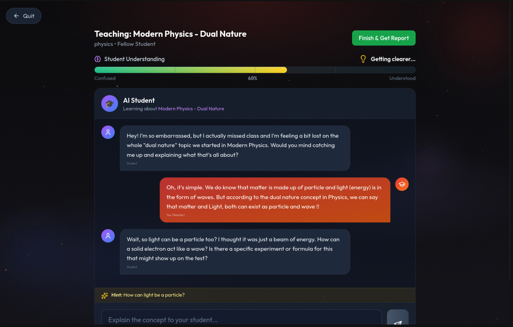

<p align="center">
  
  
  
</p>

<h1 align="center">PrepVerse</h1>

<p align="center">
  <strong>Smart Examverse for CBSE Students</strong><br/>
  Adaptive learning platform combining AI-powered tutoring, focus tools, and peer collaboration.
</p>

<p align="center">
  <a href="#-guru-ai-mode">GURU AI</a> •
  <a href="#-features">Features</a> •
  <a href="#-tech-stack">Tech Stack</a> •
  <a href="#-getting-started">Getting Started</a> •
  <a href="#-architecture">Architecture</a>
</p>

---

## GURU AI Mode

<p align="center">
  
</p>

<p align="center">
  
</p>

> *"If you can't explain it simply, you don't understand it well enough."* — Richard Feynman

**GURU Mode** is PrepVerse's breakthrough AI tutoring system that flips traditional learning on its head. Instead of passively absorbing information, students **teach concepts to an AI student** — proving mastery through explanation.

### How It Works

```
┌─────────────────────────────────────────────────────────────────┐
│                        GURU AI MODE                              │
├─────────────────────────────────────────────────────────────────┤
│                                                                  │
│   1. SELECT TOPIC         →   "Quadratic Equations"             │
│                                                                  │
│   2. CHOOSE AI PERSONA    →    5-Year-Old                     │
│                                Peer (Classmate)               │
│                                Skeptic                         │
│                                Curious Beginner               │
│                                                                  │
│   3. TEACH THE AI         →   Explain in your own words         │
│                                                                  │
│   4. AI RESPONDS          →   Asks clarifying questions         │
│                               Shows confusion level (0-100)     │
│                               Challenges weak explanations      │
│                                                                  │
│   5. REPORT CARD          →   Accuracy Score (0-10)             │
│                               Simplicity Score (0-10)           │
│                               XP Earned (50-90 XP)              │
│                                                                  │
└─────────────────────────────────────────────────────────────────┘
```

### The Feynman Technique

GURU Mode implements the **Feynman Technique** — a proven learning method where explaining concepts in simple terms reveals gaps in understanding:

| Score | Criteria |
|-------|----------|
| **Accuracy (0-10)** | Did you convey correct information? Were key concepts covered? |
| **Simplicity (0-10)** | Did you avoid jargon? Could a child understand your explanation? |

### AI Personas

Each persona creates a unique teaching challenge:

| Persona | Behavior | Challenge |
|---------|----------|-----------|
| **5-Year-Old** | No technical terms allowed | Requires analogies and simple language |
| **Peer** | Missed the lesson, needs catching up | Must explain key concepts quickly |
| **Skeptic** | Questions everything, asks for proof | Requires evidence and logical reasoning |
| **Curious Beginner** | Excited to learn, asks follow-ups | Must handle tangential questions |

### Real-Time Feedback

- **Confusion Meter**: Visual indicator showing how well the AI understands (0-100)
- **Dynamic Questions**: AI asks follow-up questions based on your explanation
- **Satisfaction Detection**: AI signals when it finally understands
- **Hidden Ground Truth**: AI internally knows the correct answer and validates explanations

### XP & Rewards

```
XP Formula = 50 (base) + (Accuracy + Simplicity) × 2

Minimum XP: 50 (for completing session)
Maximum XP: 90 (perfect 10/10 on both scores)
```

---

## Features

### Adaptive Practice
- **AI-Generated Questions**: Fresh questions powered by Gemini, tailored to your level
- **Concept-Based Difficulty**: Questions adapt based on per-topic mastery scores
- **Instant Feedback**: Explanations for every answer
- **Topic Selection**: Full CBSE curriculum for Math, Physics, Chemistry, Biology

### Focus Mode
- **Pomodoro Timer**: Configurable work/break sessions (5-120 min)
- **App Blocking** (Android): Accessibility service detects when you leave the app
- **Do Not Disturb**: Automatic DND activation during sessions
- **Violation Tracking**: 3 violations = session terminated
- **Statistics**: Track focus time, interruptions, and streaks

### Progress Dashboard
- **Real-Time Analytics**: Track accuracy, attempts, and time spent
- **Concept Mastery**: Per-topic score breakdown (0-100%)
- **Strength/Weakness Analysis**: AI-identified areas to focus on
- **Trends & Charts**: Visualize progress over time

### Peer Collaboration
- **Study Rooms**: Create rooms for 2-4 students (same school/class only)
- **Real-Time Chat**: End-to-end encrypted messaging (AES-256-CBC)
- **Collaborative Whiteboard**: Draw and explain concepts together
- **Voice Calls**: WebRTC-based peer-to-peer voice chat
- **Peer Discovery**: Find classmates studying the same topic


### Discussion Forum
- **Subject-Based Categories**: Math, Physics, Chemistry, Biology, Exam Tips
- **Nested Comments**: Reddit-style threaded discussions
- **Voting System**: Upvote helpful posts and answers
- **Search & Filter**: Find relevant discussions quickly

### Gamification
- **XP System**: Earn points for every action
- **Levels & Badges**: Progress from Beginner to PrepVerse Pro
- **Daily Streaks**: Bonus XP for consistency
- **School Leaderboards**: Compete with classmates


---

## Tech Stack

### Mobile (Android)
| Technology | Purpose |
|------------|---------|
| **Kotlin** | Primary language |
| **Jetpack Compose** | Modern declarative UI |
| **Hilt** | Dependency injection |
| **Room** | Local database (offline) |
| **DataStore** | Preferences storage |
| **Retrofit + OkHttp** | API client |
| **WebRTC** | Voice calls |

### Web (PWA)
| Technology | Purpose |
|------------|---------|
| **React 18** | UI framework |
| **TypeScript** | Type safety |
| **Vite** | Build tool |
| **TailwindCSS** | Styling |
| **Zustand** | State management |
| **Dexie.js** | IndexedDB wrapper |

### Backend
| Technology | Purpose |
|------------|---------|
| **FastAPI** | Python web framework |
| **Supabase (PostgreSQL)** | Primary database |
| **Supabase Realtime** | WebSocket channels |
| **Google Gemini Flash 3** | AI question generation & GURU mode |
| **Auth0** | Authentication (Google OAuth) |
| **Pydantic** | Data validation |

---

## Getting Started

### Prerequisites

- Python 3.11+
- Node.js 18+
- Android Studio (for mobile development)
- [uv](https://github.com/astral-sh/uv) (Python package manager)

### 1. Clone the Repository

```bash
git clone https://github.com/yourusername/prepverse.git
cd prepverse
```

### 2. Backend Setup

```bash
cd backend

# Install dependencies
uv sync

# Configure environment
cp .env.example .env
# Edit .env with your credentials:
# - SUPABASE_URL, SUPABASE_KEY
# - AUTH0_DOMAIN, AUTH0_CLIENT_ID, AUTH0_CLIENT_SECRET
# - GEMINI_API_KEY
# - SESSION_SECRET_KEY

# Start development server
uv run uvicorn app.main:app --reload
# API available at http://localhost:8000
# Docs at http://localhost:8000/docs
```

### 3. Web Setup

```bash
cd web

# Install dependencies
npm install

# Configure environment
cp .env.example .env
# Edit .env:
# - VITE_API_URL=http://localhost:8000
# - VITE_SUPABASE_URL, VITE_SUPABASE_ANON_KEY

# Start development server
npm run dev
# App available at http://localhost:5173
```

### 4. Android Setup

1. Open the project in Android Studio
2. Create `local.properties` with your SDK path
3. Configure `app/build.gradle.kts`:
   - Set API base URL (use `10.0.2.2:8000` for emulator)
4. Build and run:
   ```bash
   ./gradlew assembleDebug
   ```

---

## Architecture

```
┌─────────────────────────────────────────────────────────────────┐
│                         CLIENTS                                  │
├───────────────────────────┬─────────────────────────────────────┤
│      Android App          │           Web App (PWA)              │
│   (Kotlin + Compose)      │      (React + TypeScript)           │
│                           │                                      │
│   ┌─────────────────┐     │     ┌─────────────────┐             │
│   │   Room DB       │     │     │   IndexedDB     │             │
│   │   (Offline)     │     │     │   (Dexie.js)    │             │
│   └─────────────────┘     │     └─────────────────┘             │
│           │               │              │                       │
│   ┌─────────────────┐     │     ┌─────────────────┐             │
│   │   WorkManager   │     │     │  Service Worker │             │
│   │   (Sync)        │     │     │  (Sync)         │             │
│   └─────────────────┘     │     └─────────────────┘             │
└───────────┬───────────────┴──────────────┬──────────────────────┘
            │                               │
            │         HTTPS/WSS            │
            └───────────────┬───────────────┘
                            │
            ┌───────────────▼───────────────┐
            │          Auth0                │
            │    (Google OAuth Only)        │
            └───────────────┬───────────────┘
                            │ JWT / Session Cookie
            ┌───────────────▼───────────────┐
            │      FastAPI Backend           │
            │      (Python 3.11+)            │
            │                                │
            │  ┌──────────────────────────┐  │
            │  │   API Routes (v1)        │  │
            │  │   - /auth, /onboarding   │  │
            │  │   - /questions, /guru    │  │
            │  │   - /practice, /focus    │  │
            │  │   - /peer, /forum        │  │
            │  └──────────────────────────┘  │
            └───────────────┬────────────────┘
                            │
       ┌────────────────────┼────────────────────┐
       │                    │                    │
┌──────▼───────┐    ┌───────▼───────┐    ┌──────▼──────────┐
│   Supabase   │    │    Gemini     │    │    Supabase     │
│   PostgreSQL │    │   Flash 3     │    │    Realtime     │
│  (Primary DB)│    │     (AI)      │    │   (WebSocket)   │
└──────────────┘    └───────────────┘    └─────────────────┘
```

### Authentication Flow

PrepVerse uses **server-side OAuth** for web (HTTP-only cookies) and **client-side OAuth** for mobile (Bearer tokens):

- **Web**: Frontend → Backend `/auth/login` → Auth0 → Backend `/auth/callback` → Set Cookie
- **Android**: Chrome Custom Tabs → Auth0 → Deep Link `prepverse://auth/callback` → Store Token

See `backend/app/core/security.py` for the unified authentication handler.

---

## Project Structure

```
prepverse/
├── app/                          # Android App
│   └── src/main/java/com/prepverse/
│       ├── di/                   # Hilt modules
│       ├── data/                 # Repositories, API, local DB
│       ├── domain/               # Models, use cases
│       ├── ui/                   # Compose screens
│       │   └── screens/
│       │       ├── guru/         # GURU AI Mode
│       │       ├── practice/     # Practice Mode
│       │       ├── focus/        # Focus Mode
│       │       └── peer/         # Peer Collaboration
│       └── services/             # Foreground services
│
├── web/                          # React Web App
│   └── src/
│       ├── api/                  # API client functions
│       ├── components/           # Reusable UI components
│       │   └── guru/             # GURU Mode components
│       ├── hooks/                # Custom React hooks
│       ├── pages/                # Route pages
│       │   ├── GuruMode.tsx      # GURU AI main page
│       │   └── GuruHistory.tsx   # Teaching history
│       └── store/                # Zustand stores
│
├── backend/                      # FastAPI Backend
│   └── app/
│       ├── api/v1/               # Route handlers
│       │   ├── guru.py           # GURU Mode endpoints
│       │   ├── practice.py       # Practice endpoints
│       │   └── ...
│       ├── core/
│       │   ├── gemini.py         # Gemini AI client
│       │   ├── security.py       # Auth (cookie + bearer)
│       │   └── oauth.py          # Auth0 OAuth client
│       ├── services/
│       │   ├── guru_service.py   # GURU business logic
│       │   └── ...
│       └── schemas/              # Pydantic models
│
├── Memory.md                     # File reference & recent updates
├── SPEC.md                       # Full technical specification
└── CLAUDE.md                     # Development guidelines
```

---

## API Reference

Base URL: `http://localhost:8000/api/v1`

### GURU Mode Endpoints

| Method | Endpoint | Description |
|--------|----------|-------------|
| `POST` | `/guru/start` | Start a new teaching session |
| `POST` | `/guru/chat` | Send message, get AI response |
| `POST` | `/guru/end` | End session, get report card |
| `POST` | `/guru/abandon` | Quit without grading |
| `GET` | `/guru/history` | View past sessions |
| `GET` | `/guru/active` | Check for active session |

### Other Endpoints

| Module | Key Endpoints |
|--------|---------------|
| Auth | `/auth/login`, `/auth/callback`, `/auth/me`, `/auth/logout` |
| Onboarding | `/onboarding/questions`, `/onboarding/submit`, `/onboarding/status` |
| Practice | `/practice/session/start`, `/practice/session/{id}/submit` |
| Questions | `/questions/generate`, `/questions/topics` |
| Progress | `/progress/dashboard`, `/progress/concepts` |
| Focus | `/focus/start`, `/focus/end`, `/focus/history` |
| Peer | `/peer/sessions`, `/peer/messages`, `/peer/availability` |
| Forum | `/forum/`, `/forum/{postId}/comments`, `/forum/{postId}/vote` |

Interactive API docs: `http://localhost:8000/docs`

---

## Security

- **Authentication**: Auth0 with Google OAuth only
- **Session Management**: HTTP-only cookies (web), encrypted storage (Android)
- **Database**: Supabase with Row Level Security (RLS)
- **Peer Chat**: End-to-end encryption (AES-256-CBC)
- **API**: HTTPS enforced in production

---

## Target Users

- **CBSE Class 10 & 12 Students**
- **Subjects**: Mathematics, Physics, Chemistry, Biology
- **India-focused**: 20,000+ CBSE schools in database for peer matching

---

## License

MIT License - see [LICENSE](LICENSE) for details.

---

## Acknowledgments

- [Google Gemini](https://ai.google.dev/) for powering GURU AI Mode
- [Auth0](https://auth0.com/) for authentication
- [Supabase](https://supabase.com/) for database and realtime features
- [Feynman Technique](https://fs.blog/feynman-learning-technique/) for the learning methodology

---

<p align="center">
  <strong>Built with ❤️ for CBSE students</strong><br/>
  <sub>Making exam prep smarter, not harder.</sub>
</p>
